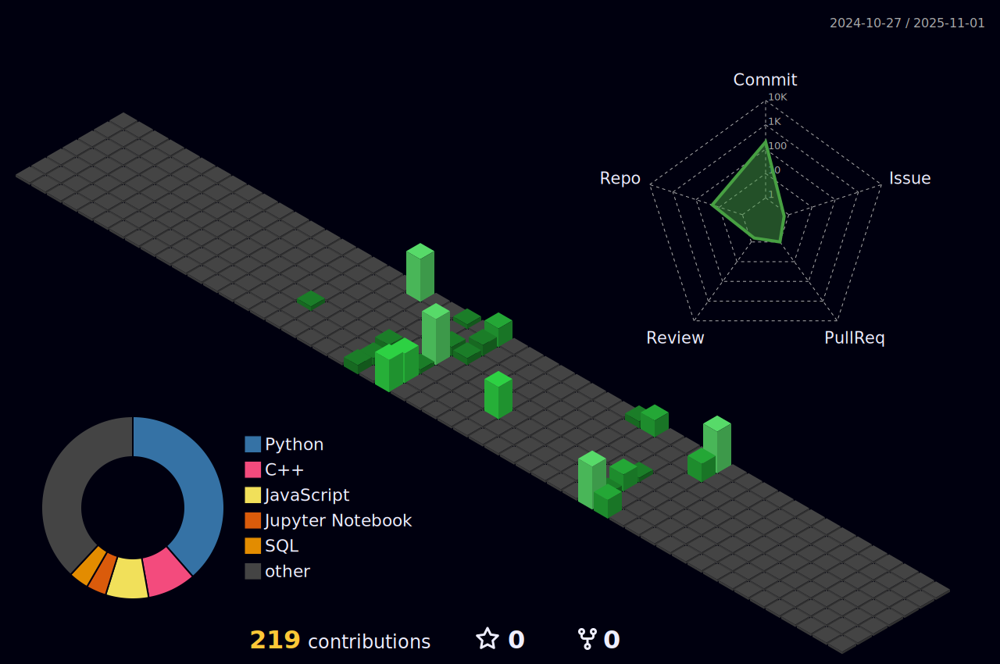

<h1 align="center">Hi 👋, I'm Manan Kumar</h1>
<h3 align="center">Passionate AI/ML Engineer | Deep Learning Enthusiast</h3>

  
  

<!-----

  

------->

  

---

### 🚀 About Me

- 🌱 I'm currently diving deep into **LLMs** and **Retrieval-Augmented Generation (RAG)**.  
- 💬 Ask me about **PyTorch, Machine Learning, Deep Learning, NLP**.  
- ⚡ Fun fact: I brew coffee and neural networks with equal passion!  
- 🚀 Mission: Cracking AI's toughest puzzles—one model at a time!
  

---

### 🛠️ Languages and Tools

  
  
  
  
  
  
  
  
  
  
  
  
  
  
  
  
  
  
  
  
  
  
  
  

---

### 📊 GitHub Stats & Languages Overview

  
  

  
---

### 📊 LeetCode Stats & Badges

  

  
  
  
  

---

### 📈 3D Contribution Graph

  

---

<!---
### 🏆 Achievements & Stats

  

---

---->

### 🌟 Connect with Me

  

<!--

  

---->
